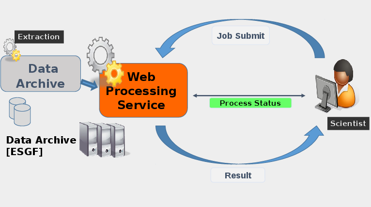
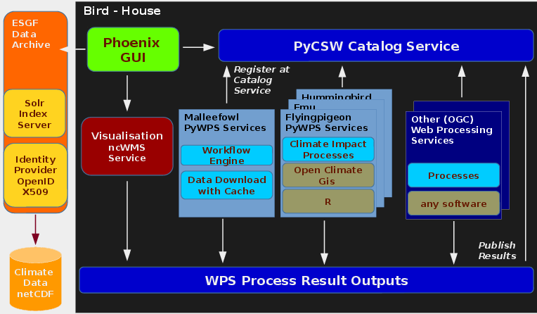

.. _overview:
************
Overview
************

.. _wps_use_case:
============
WPS Use Case
============

A user runs a WPS processes remotely on a machine with direct access to climate data archives.

.. _birdhouse_overview:
=============================
Birdhouse with WPS components
=============================

ESGF is currently the main climate data resource (but more resources are possible). ESGF Solr-index is used to find ESGF data. The ESGF identity provider with OpenIDs and X509 certificate is used for authenticatin.

There are several WPS services. Malleefowl is the main one for the Phoenix client. Malleefowl is used to search, download (with caching) ESGF data and to retrieve certificates. Malleefowl has also a workflow engine (dispel4py) to chain WPS processes. 

The results of the WPS processes are stored on the file system and are accessible via URL (with a token id).

Results can be shown on a Map using a Web Mapping Service (ncWMS, adagucserver).

The PyCSW Catalog Service is used to register WPS services and also to publish WPS outputs. Published results in the PyCSW can also used as input source for processes again.

WPS serivces can be accessed through web-applications like Phoenix or from scripts.

