.. _tutorial_cdoensemble:

Run CDO ensemble operation on CMIP5 data from ESGF
==================================================

First you need to login. Please follow the login instructions in the :ref:`user guide <login>`.

.. contents::
   :local:
   :depth: 2
   :backlinks: none

Use the Wizard
--------------

.. image:: ../_images/tutorial/wizard.png

Select Hummingbird WPS Service
------------------------------

For this example choose the Hummingbird WPS service which has CDO processes.

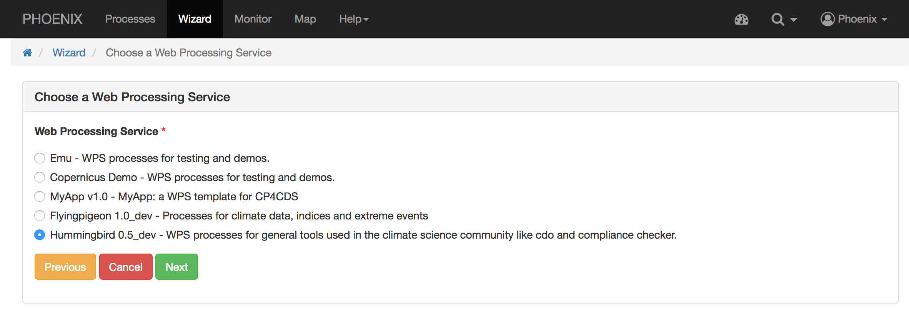

Choose "CDO Ensembles Operation" Process
----------------------------------------

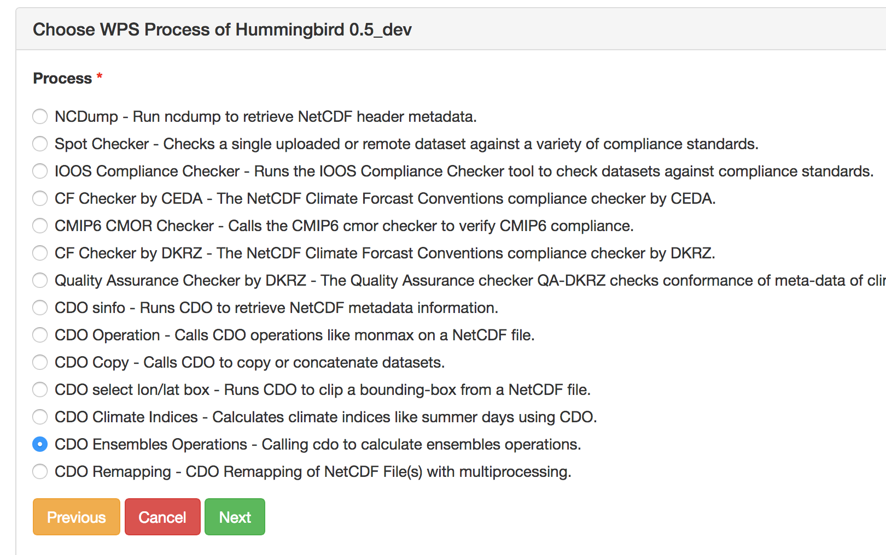

Choose CDO ensmean Operator
---------------------------

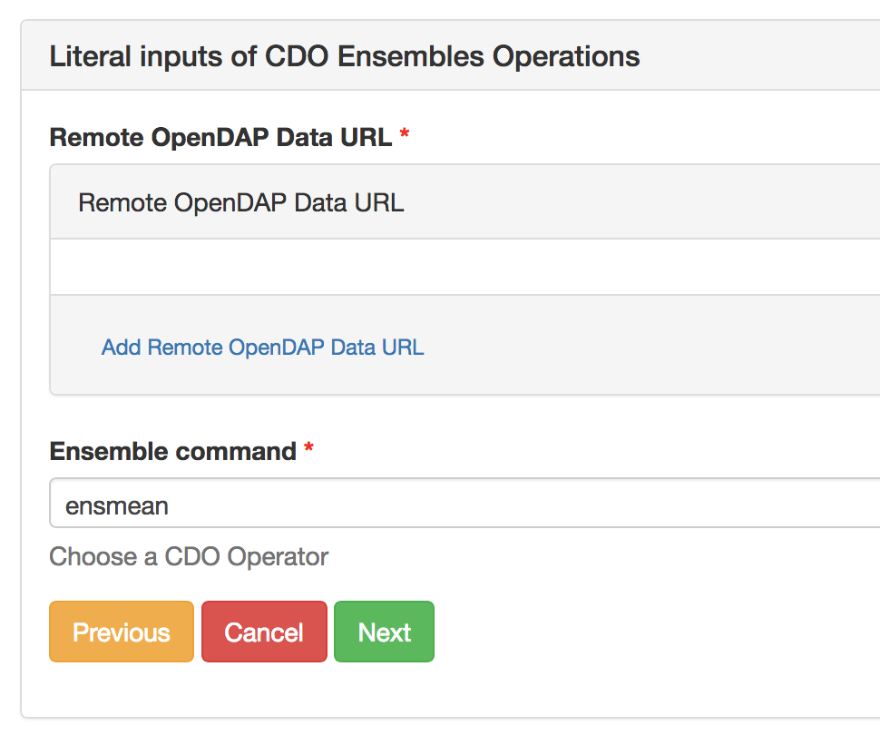

Choose Input Parameter
----------------------

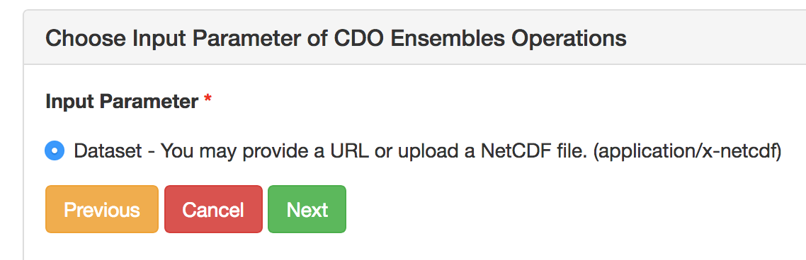

Choose ESGF as Source
------------------------

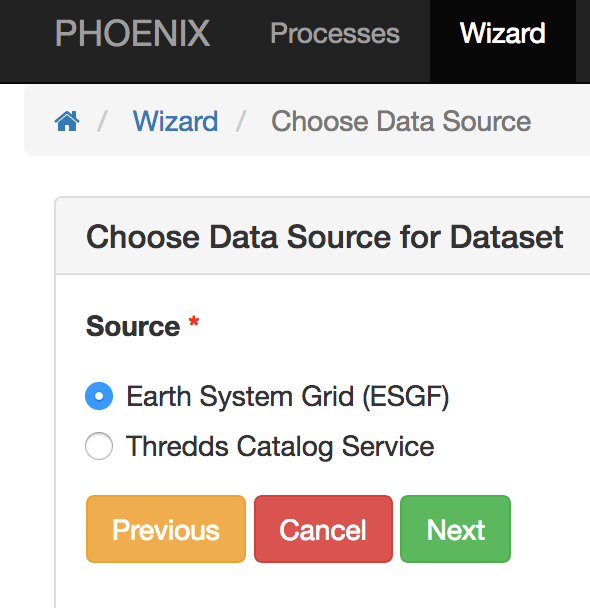

Update your ESGF credentials if asked
-------------------------------------

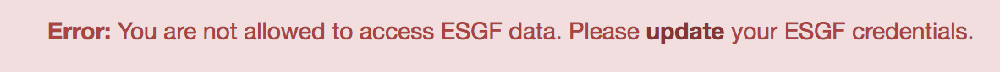

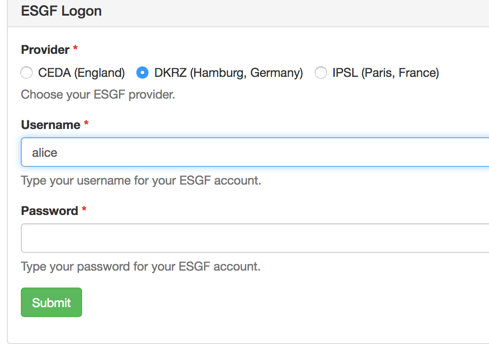

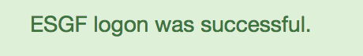

Select ensembles of CMIP5 experiment
------------------------------------

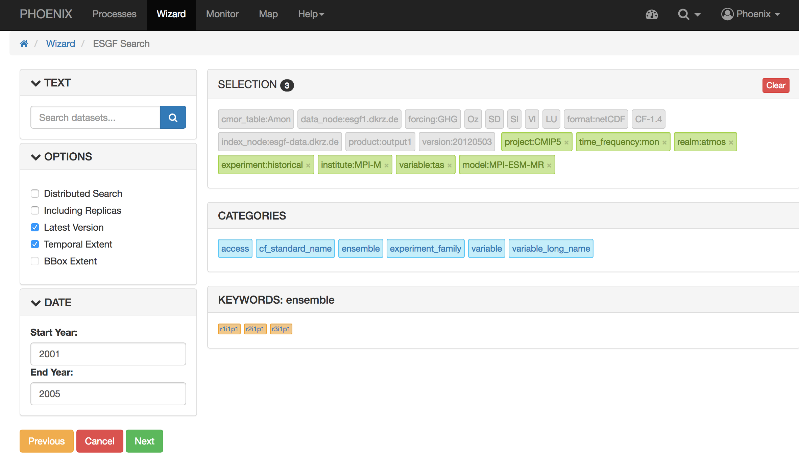

Start Process
------------------------

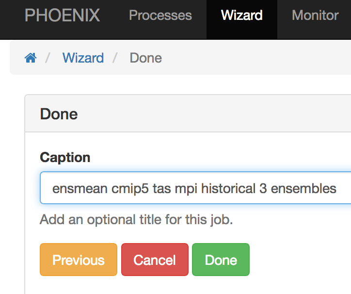

Monitor running Job
-------------------

The job is now submitted and can be monitored on the *Monitor* page:

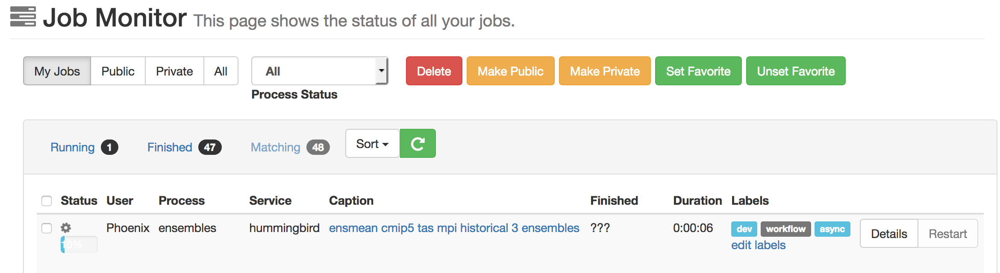

Display the outputs
-------------------

Click on the ``Details`` button to get to the result of the submitted process.

**Outputs**

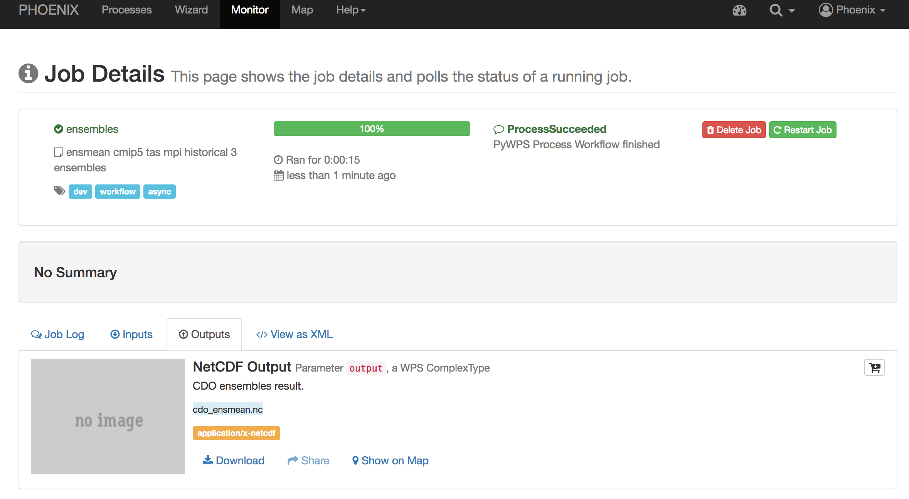

**Map**

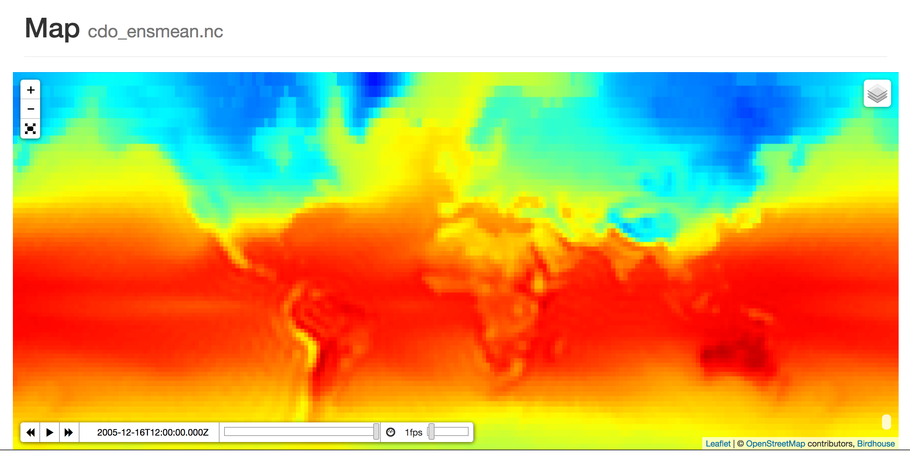
