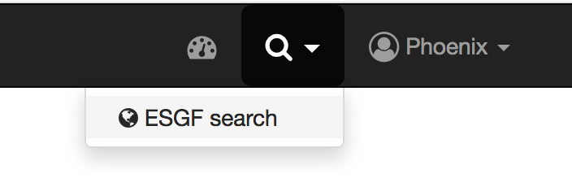
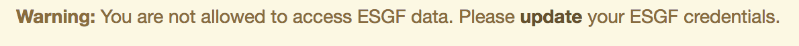
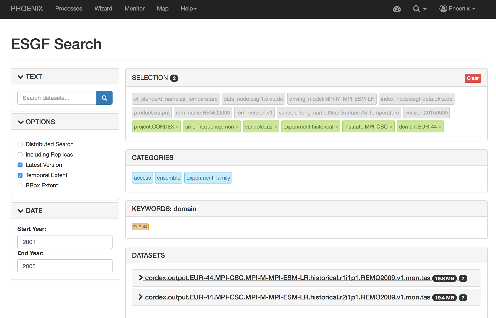
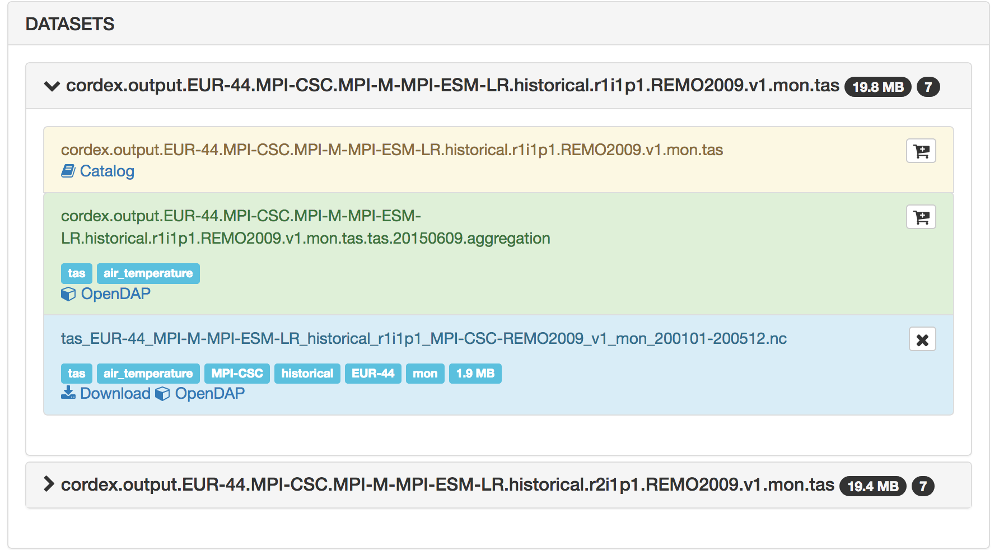
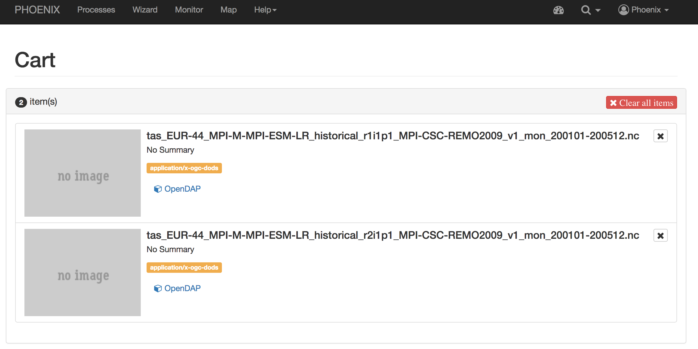
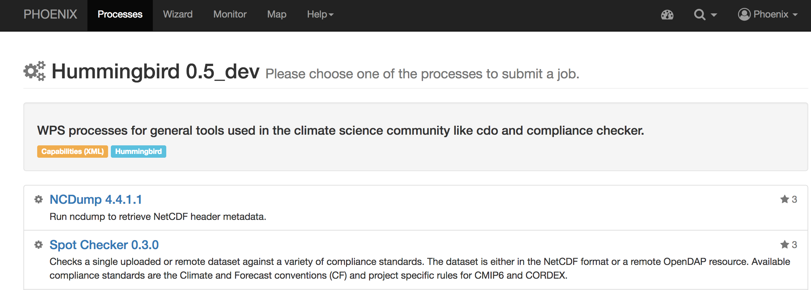
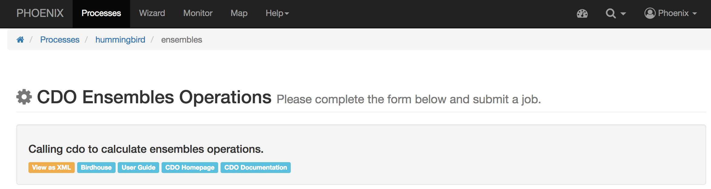
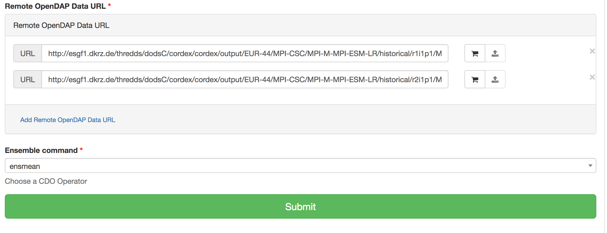
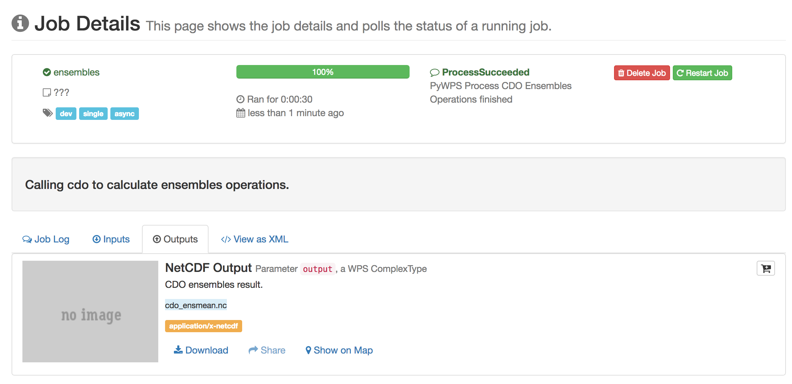
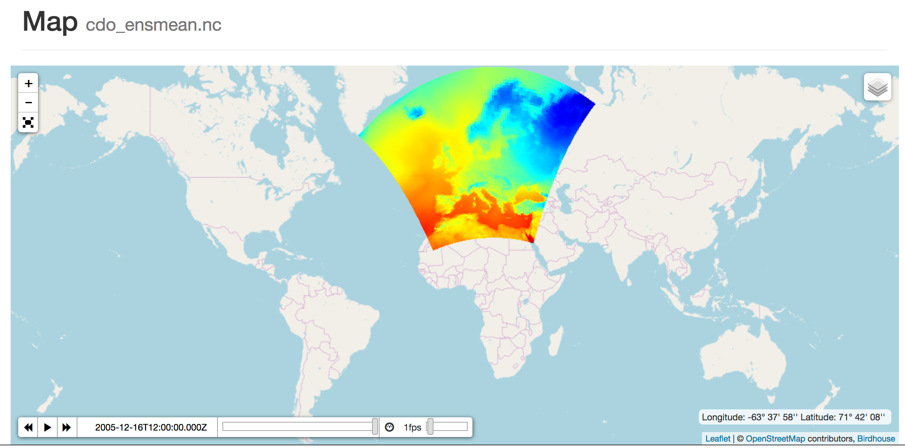

.. _tutorial_cdoopendap:

Run CDO ensemble operation on CORDEX data from ESGF using OpenDAP
=================================================================

First you need to login. Please follow the login instructions in the :ref:`user guide <login>`.

.. contents::
   :local:
   :depth: 2
   :backlinks: none

Search and select CORDEX ensembles
----------------------------------

**Activate ESGF Search**

**Update ESGF credentials if asked**

**Search CORDEX Ensemble**

**Select Files (OpenDAP)**

Check the selected files in Cart (optional)
-------------------------------------------

.. image:: ../_images/tutorial/ensmean_opendap_cart.png
  :scale: 50%

Select Hummingbird WPS Service
------------------------------

Choose the Hummingbird WPS service which has CDO processes.

Choose "CDO Ensembles Operation" Process
----------------------------------------

Choose CDO ensmean Operator and OpenDAP datasets
------------------------------------------------

Monitor running Job
-------------------

The job is now submitted and can be monitored on the *Monitor* page:

.. image:: ../_images/tutorial/ensmean_opendap_monitor.png

Display the outputs
-------------------

Click on the ``Details`` button to get to the result of the submitted process.

**Outputs**

**Map**

