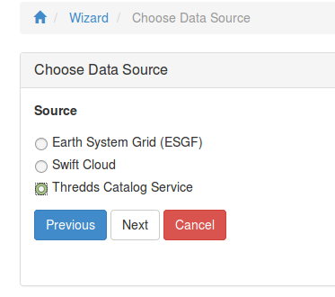
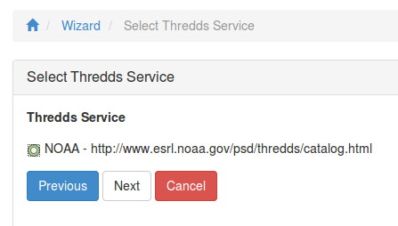
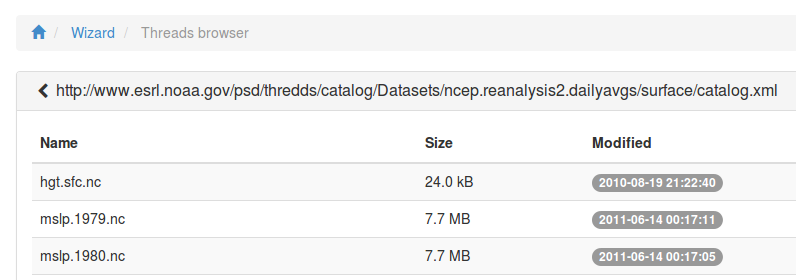
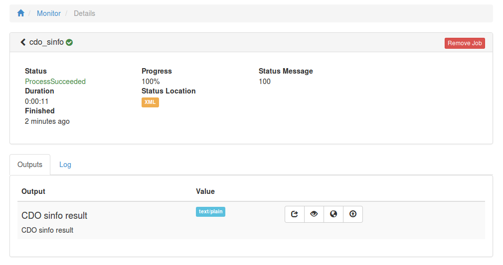

.. _tutorial_cdosinfo: 

Run CDO sinfo on data from Thredds Dataservice
==============================================

First you need to login. Please follow the login instructions in the :ref:`user guide <login>`.

.. contents::
   :local:
   :depth: 2
   :backlinks: none

Use the Wizard
--------------

.. image:: ../_images/tutorial/wizard.png 

Select Hummingbird WPS Service
------------------------------

For this example choose the Hummingbird WPS service which has CDO processes.

.. image:: ../_images/tutorial/ci_hummingbird.png 

Choose "CDO sinfo" Process
--------------------------

.. image:: ../_images/tutorial/ci_process.png

Choose Input Parameter
----------------------

.. image:: ../_images/tutorial/ci_input.png

Choose Thredds as Source
------------------------

Choose Thredds Service
------------------------

Choose Data from Thredds Catalog
------------------------

Start Process
------------------------

.. image:: ../_images/tutorial/ci_done.png

Monitor running Job
-------------------

The job is now submitted and can be monitored on the *Monitor* page: 

.. image:: ../_images/tutorial/ci_monitor.png

Display the outputs
-------------------

Click on the Job ID link to get to the result of the submitted process.

**Job Log**

.. image:: ../_images/tutorial/ci_log.png

**Job Outputs**

