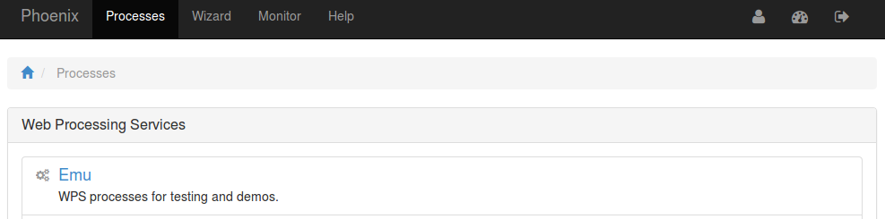
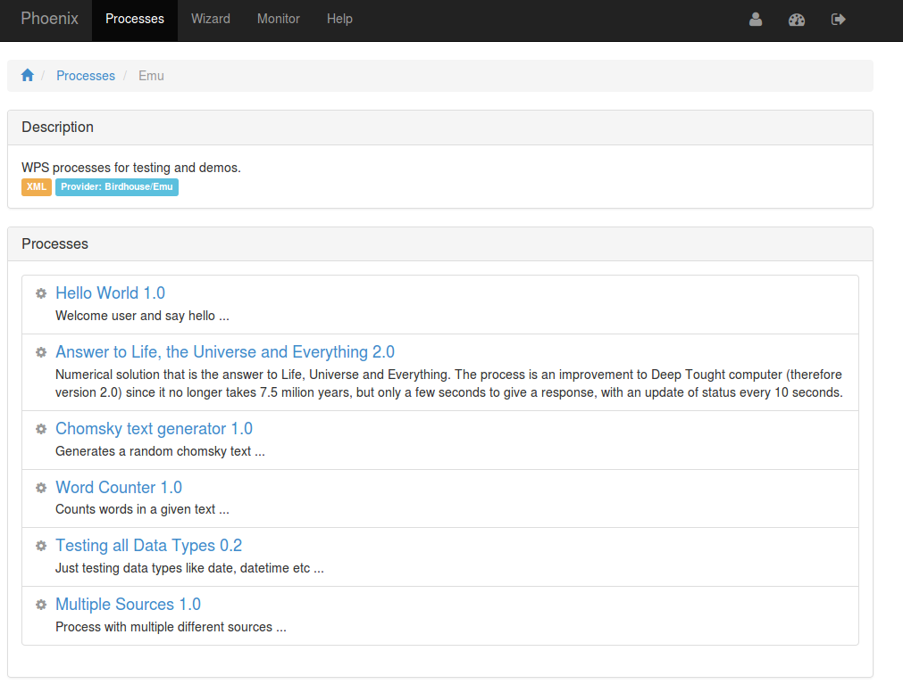
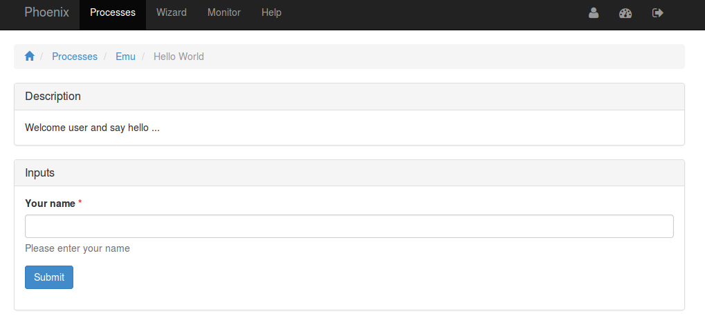
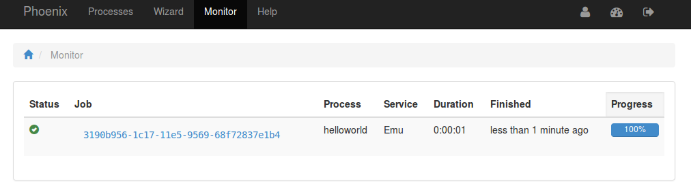
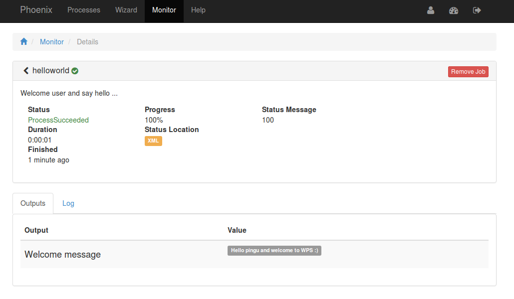

.. _tutorial_helloworld: 

Hello World
==========================

First you need to login. Please follow the login instructions in the :ref:`user guide <login>`.

.. contents::
   :local:
   :depth: 2
   :backlinks: none

Select Emu WPS Service
----------------------

For this example choose the Emu WPS service which has test processes. For this go to the ``Processes`` tab.

Choose Hello World Process
--------------------------

With clicking on *Emu* you will get the list of available processes in Emu.

Enter Process Parameters
------------------------

Click on *Hello World* and you will get a form to enter the process parameter: 

Enter your name and click ``submit``.

Monitor running Job
-------------------

The job is now submitted and can be monitored on the *Monitor* page: 

Display the outputs
-------------------

Click on the Job ID link to get to the result of the submitted process.

