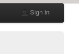

.. _tutorial:

********
Tutorial
********

Phoenix is a Web Processing Service (WPS) for the earth systhem modelling community. The service offers an easy to use graphical user interface as a valuable practical tool to process and analyze big data. WPS represents an interface to perform processes over the HTTP network protocol, enabling users to trigger processes over a website. 

In the following tutorial will guide you though the first stepps to get familliar with Phoenix. 

-----------------------------
**Login and Accout settings**
-----------------------------

The login is realized with your personal openID of ESGF. Make sure, that you have a valid openID of one of the ESGF datanodes (http://esgf-data.dkrz.de/esgf-web-fe/) and that you at least once were able to download a datafile. 

You will find the login in the upper right corner: 

Enter your personal openID. Please use the full path:

.. image:: openid.png

And enter you appropriate password. 
In the current state of Phoenix (May 2014) you have to be personally activated in the Phoenix-WPS. 
If you are not activated please contact Nils Hempelmann (nils.hempelmann@hzg.de) with an sort description of your motivation to use Phoenix.

With a sucessful login your token is updated and valid as well:

.. image:: access_status_sucess.png

The token as well as your security cetificate (necessary to access the ESGF data archive ) can be seen and updated under *My Account*: 

.. image:: accout_settings.png

--------------------------------
**Creating some overview plots**
--------------------------------

.. image:: wizard.png
:height: 100px
:width: 200 px
:scale: 50 %
:alt: alternate text
:align: right

Calculation of summer days per year 

Future
------

This will all change in future ...