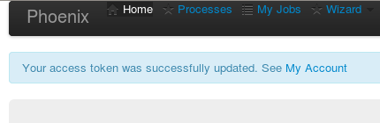
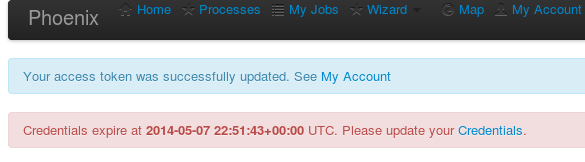

.. _tutorial_login:

-----------------------------
**Login and Accout settings**
-----------------------------

The login is realized with your personal openID of ESGF. Make sure, that you have a valid openID of one of the ESGF datanodes (http://esgf-data.dkrz.de/esgf-web-fe/) and that you at least once were able to download a datafile. 

You will find the login in the upper right corner: 

.. image:: ../_images/signin.png

Enter your personal openID. Please use the full path:

.. image:: ../_images/openid.png

And enter you appropriate password. 
In the current state of Phoenix (May 2014) you have to be personally activated in the Phoenix-WPS. 
If you are not activated please contact Nils Hempelmann with an sort description of your motivation to use Phoenix.

With a sucessful login your token is updated and valid as well:

The token as well as your security cetificate (necessary to access the ESGF data archive ) can be seen and updated under *My Account*: 

.. image:: ../_images/accout_settings.png

For security reasons the certificate and the token is time limited valid. But don't worry; Phoenix will remind you to update if necessary:

