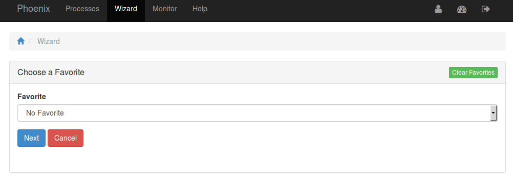
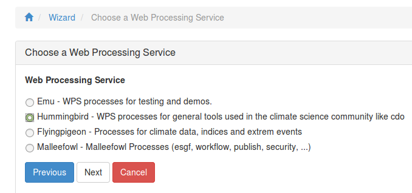
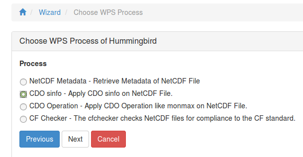
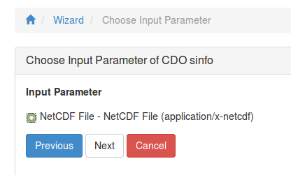
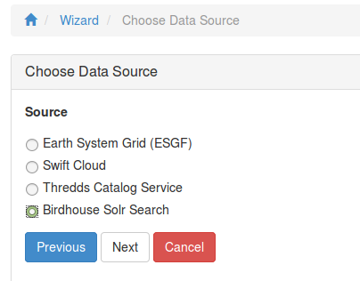
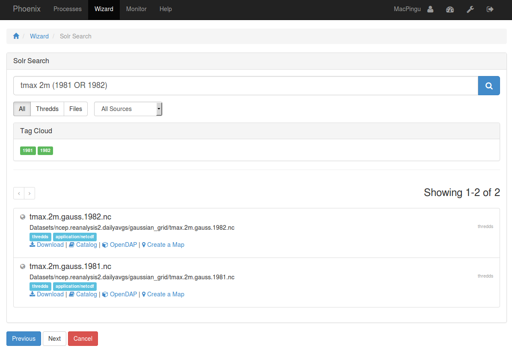
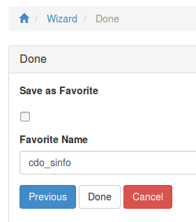
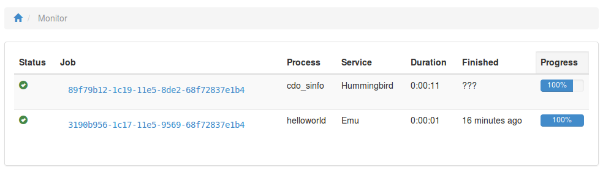
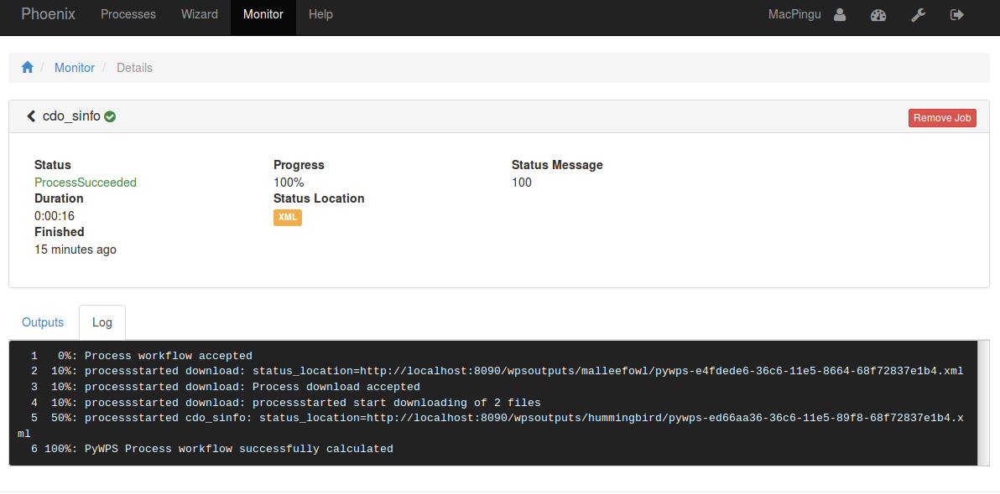
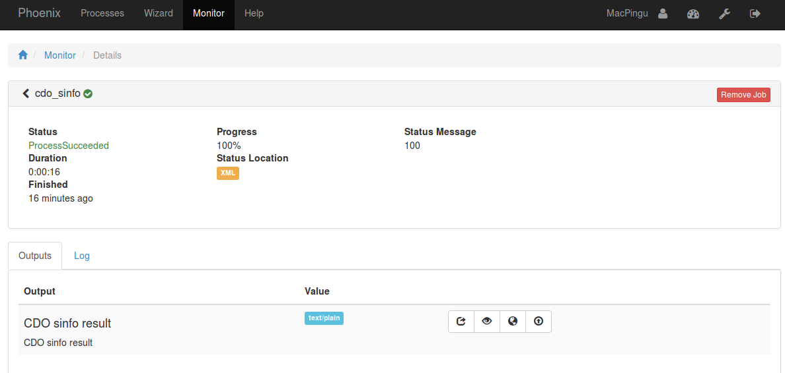

.. _tutorial_solrsearch: 

Use the Birdhouse Solr Search in the Wizard
===========================================

First you need to login. Please follow the login instructions in the :ref:`user guide <login>`.

.. contents::
   :local:
   :depth: 2
   :backlinks: none

Prepare Solr Search (Admins only)
---------------------------------

Register a thredds catalog in ``Settings/Services``. For example use:

http://www.esrl.noaa.gov/psd/thredds/catalog/Datasets/ncep.reanalysis2.dailyavgs/catalog.html

Index this Thredds Catalog in ``Settings/Solr``. 

Use the Wizard
--------------

Select Hummingbird WPS Service
------------------------------

For this example choose the Hummingbird WPS service which has CDO processes.

Choose "CDO sinfo" Process
--------------------------

Choose Input Parameter
----------------------

Choose Birdhouse Solr as Source
------------------------

Choose Data from Solr Search
------------------------

Start Process
------------------------

Monitor running Job
-------------------

The job is now submitted and can be monitored on the *Monitor* page: 

Display the outputs
-------------------

Click on the Job ID link to get to the result of the submitted process.

**Job Log**

**Job Outputs**

