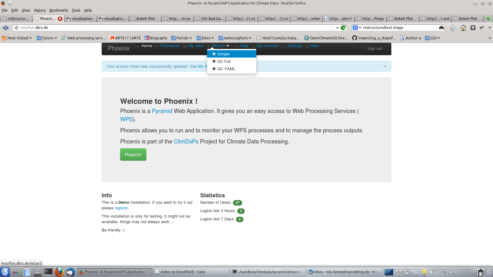
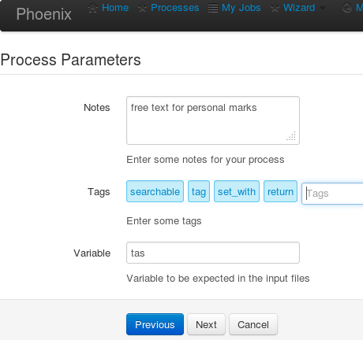
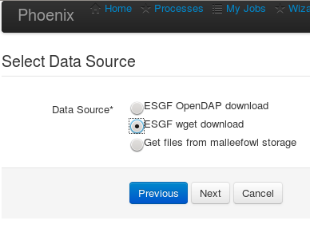
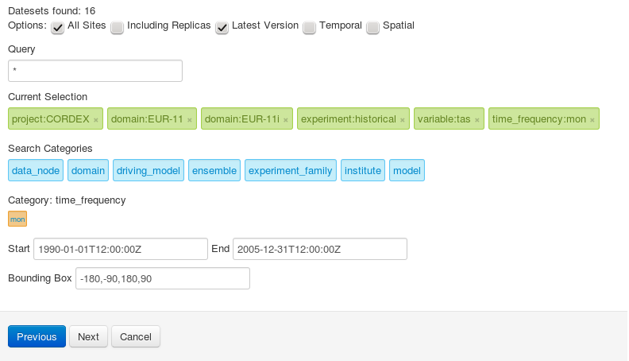
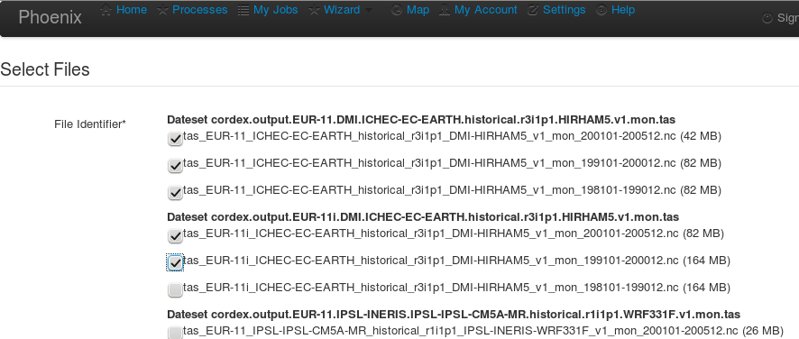
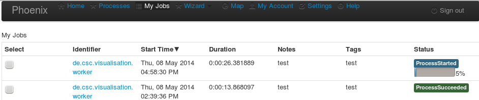
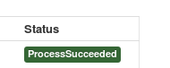
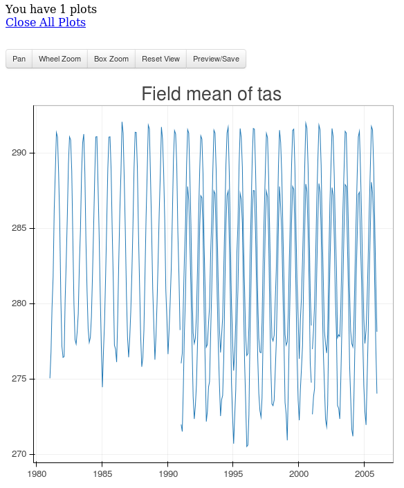

.. _Creating a timeseries plot: 

--------------------------------
**Creating a timeseries plot**
--------------------------------

Once the login procedure is done, processes are operable and data search and download within the ESGF data archive is possible. 
There are two ways to submit a process: 

- Processes
or 

- Wizard

While with *Processes* you can select single operational processes the *Wizard* is guiding you through the necessary stepps to submit a job. For getting an idea of the operation procedure choose the *Wizard* menue and select **simple**: 

The following steps are necessary to submit a job: 

* selection of WPS Node
* Select Process
* Process Parameters
* Select Data Source
* Search Input Files
* Select Files
* Access Parameters

and 

And check the listed *PyWPS Server on mouflon.dkrz.de (mouflon)* . 
With clicking on *Next* you'll find the list of available processes. 
Check the **Visualisation of data** and klick on *Next* which guides you to the process parameter: 

The values in the data files are stored with defined varable names. Here are the most common ones: 

* tas -- mean air temperaure at 2m (in Kelvin)
* tasmin -- minimum air temperaure at 2m (in Kelvin)  
* tasmax -- maximum air temperaure at 2m (in Kelvin)
* pr -- pricipitation fulx at surface (in kg/second)
* ps -- air pressure at surface
* huss -- specific humidiy (in Kg/Kg)

A list of available variable names used for CMPI5 and CORDEX experiment can be found here in the Appendix B of this document: http://cordex.dmi.dk/joomla/images/CORDEX/cordex_archive_specifications.pdf . 

**Select Data Source**

In the next step you will choose the data source. 
Basically you can choose between the ESGF Data archive (with two different download options:

**Search Input Files**

This is a search GUI to find appropriate files stored in ESGF Data archive. 
By selecting a Search Categorie (blue buttons), you can choose the appropriate options (in orange). 

In this example select the following parameter: 

+----------------+------------+
| Categorie      | Option     |
+================+============+
| project        | CORDEX     |
+----------------+------------+
| domain         | EUR-11     |    
|                | EUR-11i    |
+----------------+------------+ 
| experiment     | historical |
+----------------+------------+
| variable       |   tas      |   
+----------------+------------+
| time_frequency |   mon      |
+----------------+------------+

Double selection (like two domains) can be realized with pressing *Ctrl* - tab. 

For the visualisation process it is necessary that the selected variable is similat to the entered variable argument in the *Process Parameters*

And optional you can set the  
Start: 1990-01-01T12:00:00Z and 
End:   2005-12-31T12:00:00Z 

The Selection should look similar to:

**Select Files**

After submitting the *Search Input Files* a serach process will give you a list of all suitable Datasets with the appropriate files. 
Here you can do the final selection of the data files to be processed. In this example we select the first five files: 

**Access Parameters** 

Due to the download option ESGF wget, nothing selectable here. 
The job can be submitted with pressing *Done*

The job is now submitted and can be monitored in the *My Jobs* menue: 

Now starts the current Job. The date will be downloaded (and automatically stored in your personal folder). 
The data will be anaysed, due to the process. In this case, a field mean over the whole domain will be performed and an appropriate timeline drawn. 

If the job is finished, the staus bar is tuning into green: 

.. image:: valuedownload.png

Klick on the green *status succeeded* to get to the result of the submitted process.
In this case, it is an html Url. 
Opening it in a new browser tab gives the following result: 

