.. _tutorial_timeseries_plot: 

Creating a timeseries plot
==========================

First you need to login. Please follow the login instructions in the :ref:`user guide <login>`.

Once the login procedure is done, processes are operable and data search and download within the ESGF data archive is possible. 
There are two ways to submit a process: *Processes* or *Wizard*

While with *Processes* you can select single operational processes the *Wizard* is guiding you through the necessary steps to submit a job. For getting an idea of the operation procedure choose the *Wizard* tab: 

.. image:: ../_images/wizard.png

You could choose a favorite here of a previous run job but in this case please choose *No Favorite* and click *Next*.

The following steps are necessary to run a visualisation job: 

.. contents::
   :local:
   :depth: 2
   :backlinks: none

Select WPS Service
------------------

For this example choose the Flyingpigeon WPS service which has processes for the climate impact community.

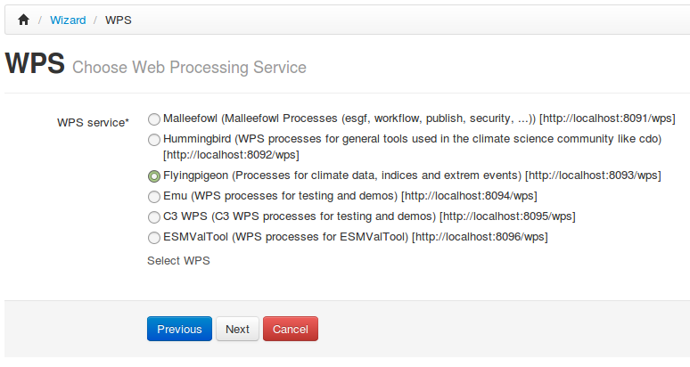

Choose Process
--------------

With clicking on *Next* you'll find the list of available processes. 
Check the *Visualisation of NetCDF files*.

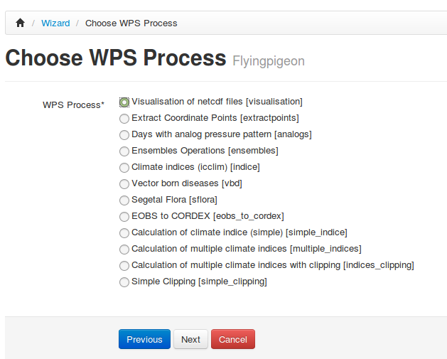

Enter Process Parameters
------------------------

Click on *Next* which guides you to the process parameter: 

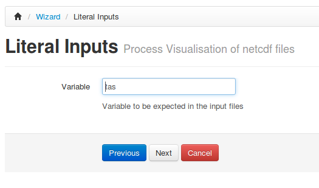

The values in the data files are stored with defined variable names. Here are the most common ones: 

* tas -- mean air temperaure at 2m (in Kelvin)
* tasmin -- minimum air temperaure at 2m (in Kelvin)  
* tasmax -- maximum air temperaure at 2m (in Kelvin)
* pr -- pricipitation fulx at surface (in kg/second)
* ps -- air pressure at surface
* huss -- specific humidiy (in Kg/Kg)

A list of available variable names used for :term:`birdhouse:CMIP5` and :term:`birdhouse:CORDEX` experiment can be found in the `Appendix B of the CORDEX archive design <http://cordex.dmi.dk/joomla/images/CORDEX/cordex_archive_specifications.pdf>`_. 

Select Data Source
------------------

In the next step you will choose the data source. Currently there is only the ESGF data archive:

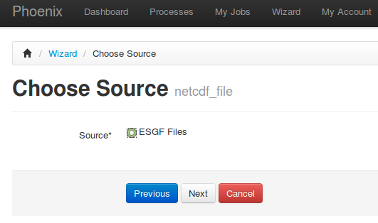

Search Input Files
------------------

This is a search GUI to find appropriate files stored in ESGF data archive. 
By selecting a *Search Categorie* (blue buttons), you can choose the appropriate options (in orange). 

In this example select the following parameter: 

+----------------+------------+
| Categorie      | Option     |
+================+============+
| project        | CORDEX     |
+----------------+------------+
| domain         | WAS-44     | 
+----------------+------------+ 
| insitute       | MPI-CSC    |   
+----------------+------------+ 
| variable       |   tas      |   
+----------------+------------+
| time_frequency |   day      |
+----------------+------------+

Double selection (like two domains) can be realized with pressing *Ctrl* - tab. 

For the visualisation process it is necessary that the selected variable (``tas``) is the same as the
variable argument in the *Process Parameters*

And optionally you can set the time bounds:: 

    Start: 2005-01-01T12:00:00Z
    End:   2010-12-31T12:00:00Z 

The Selection should look similar to the following screenshot:

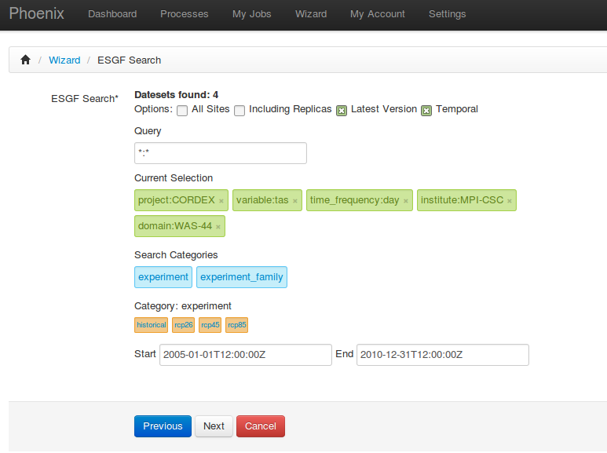

Check your credentials
----------------------

To access ESGF data you need an x509 proxy certificate from ESGF. You can update your certificate in :ref:`My Account <myaccount>`. The x509 proxy certificate is valid only for a few hours. The wizard checks if your certificate is still valid and if not you will be asked to update it on the following wizard page.

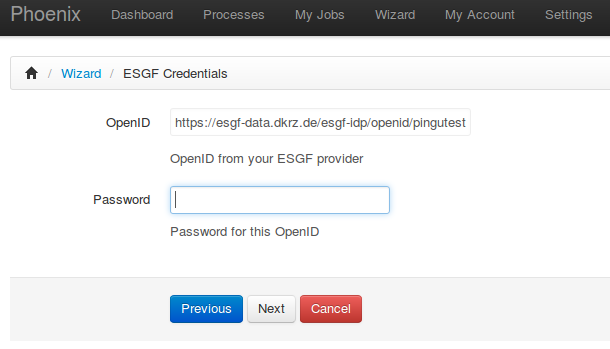

Start the process
-----------------

On the final page *Done* of the wizard you can give some descriptive keywords for your process. You can also save it as a favorite so that later you can run the same job again.

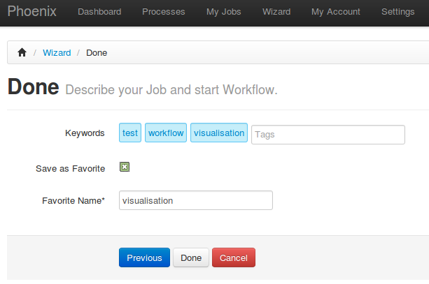

Press *Done* and the job will start.

Monitor running Job
-------------------

The job is now submitted and can be monitored on the *My Jobs* page: 

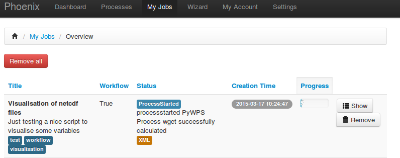

The job is running ... data will be downloaded and the analyzing of the data starts. In this case, a field mean over the several experiments will be performed and an appropriate timeline drawn. 

When the job has finished, the status bar is turning into green: 

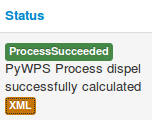

Display the outputs
-------------------

Click on the *Show* button to get to the result of the submitted process.

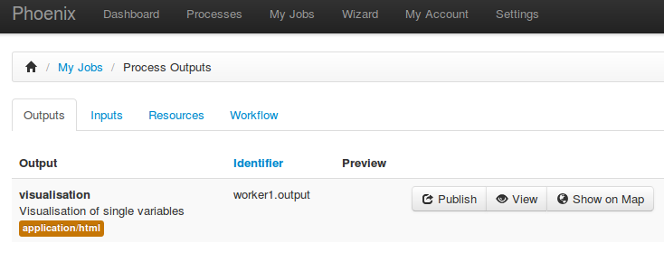

In this case, it is an URL pointing to a HTML page with an embedded interactive plot using :term:`birdhouse:bokeh`. 
Opening it in a new browser tab gives the following result: 

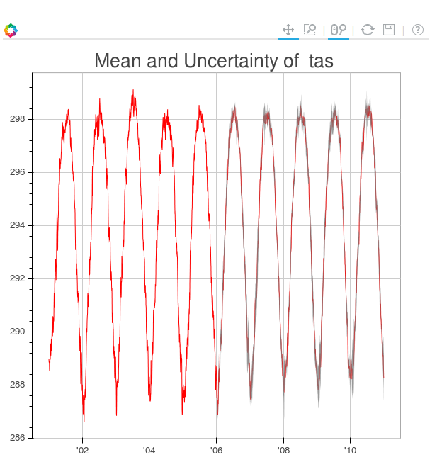

