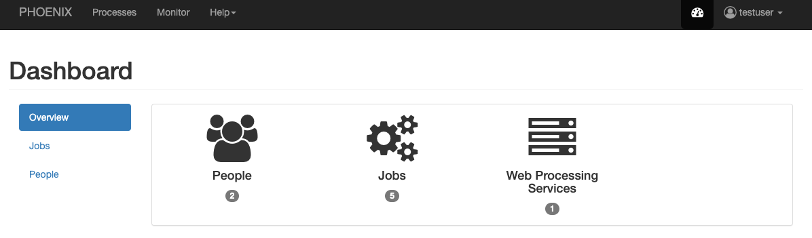
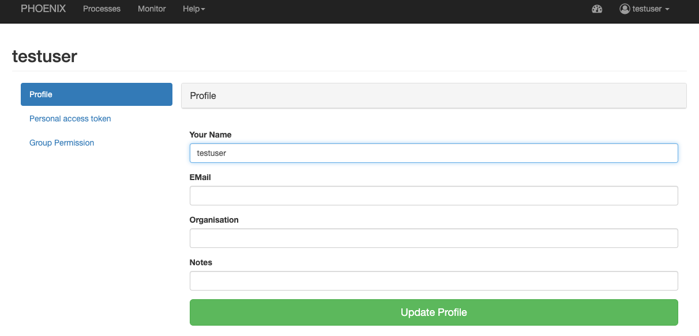

.. _userguide:

User Guide
==========

The user guide explains how to use the Phoenix web application to interact with Web Processing Services.

.. contents::
    :local:
    :depth: 2

.. _login:

Login
-----

You need an :term:`birdhouse:OpenID` account to login to Phoenix. You should use a `ESGF OpenID <https://github.com/ESGF/esgf.github.io/wiki/ESGF_Data_Download>`_ which is used later to access files from :term:`birdhouse:ESGF`. Make sure, that you have a valid OpenID of one of the ESGF datanodes (http://esgf-data.dkrz.de/esgf-web-fe/) and that you are able to download a datafile. 

Now, press the ``Sign in`` button in the upper right corner.

.. image:: _images/signin.png

Next you will have a page where you can enter the account name of your ESGF OpenID. 
Choose the according ESGF OpenID provider (by default this is DKRZ).

.. image:: _images/openid.png 

In the current state of Phoenix (March 2015) you have to be :ref:`personally activated <activate_users>` in the Phoenix web application. 

Dashboard
---------

The dashboard shows some statistics about jobs and users. Currently there is not that much to see.

.. _processes:

Processes
---------

When you have registered WPS services you can run a process. Go to the
``Processes`` tab. 

.. image:: _images/processes.png

Use the ``Choose WPS`` button to choose one of your registered WPS services. 

.. image:: _images/processes_choose.png

You will get a list of available processes (WPS ``GetCapabilities`` request). 

.. image:: _images/processes_list.png

Choose one of these processes by using the ``Execute`` button. 

.. _execute:

In case of Malleefowl you may try the ``Logon with ESGF OpenID`` process. You will then be
prompted to enter your ESGF OpenID (e.a. https://esgf-data.dkrz.de/esgf-idp/openid/justatest) and
password. 

.. image:: _images/processes_execute.png

Press the ``Submit`` button. When the process is submitted you will be shown your job list in ``My Jobs``. 

.. _myjobs:

My Jobs
-------

In ``My Jobs`` all your running or finished jobs are listed. 
The list shows the status and progress of your jobs. 

.. image:: _images/myjobs.png

When a job has finished with success you can see the results by using the ``Show`` button.  

.. image:: _images/myjobs_output.png

If the result has a document (XML, text, NetCDF, ...) you can view or download this document with the ``View`` button.

.. _wizard:

Wizard
------

The wizard is used to chain WPS processes and to collect the input
parameters for the processes. Currently the wizard chains a user WPS process with a WPS
process to retrieve ESGF data. The chained processes are run 
with :term:`a workflow management system <birdhouse:workflow>` which is available as WPS process in
:ref:`Malleefowl <malleefowl:introduction>`. 

Go to the ``Wizard`` tab. Enter the
appropiate parameters and use ``Next`` to get to the next wizard
page. 

.. image:: _images/wizard.png

You need to choose a WPS service (e.a. Malleefowl). 

.. image:: _images/wizard_wps.png

Choose a process (in case of Malleefowl only ``Dummy``).

.. image:: _images/wizard_process.png

Select the input parameter of the choosen process (mime-type application/netcdf). 

.. image:: _images/wizard_complexinput.png

Select the input source (ESGF). 

.. image:: _images/wizard_source.png

Select an ESGF dataset (select categorie (blue) and values of this category (orange), current selection (green)). 

.. image:: _images/wizard_search.png

Please select **only one Dataset**! 

You will be prompted for your password of your OpenID if your certificate is not valid anymore. 

.. image:: _images/wizard_credentials.png

On the final page you can enter some keywords for your process and mark it as favorite (when using a favorite you don't
need to enter all parameters again). Press ``Done`` and the job will be started and shown in your job list ``My Jobs``. 

.. image:: _images/wizard_done.png

.. _myaccount:

My Account
----------

In ``My Account`` you can change your user settings (user name, organisation, openid, ...).

If you have a valid ESGF OpenID you can update your X509 credentials. This is a X509 proxy certificate which is used to access ESGF data. To update press the button ``Update Credentials`` and enter your OpenID password in the dialog.

.. image:: _images/update_creds.png

For security reasons the X509 proxy certificate is time limited. But don't worry; Phoenix will remind you to update if necessary.

Settings (admins only)
----------------------

When you are logged-in as admin user you have the ``Settings`` page. Here you can make administrative changes and monitor services. 

.. image:: _images/settings.png

.. _register_wps:

Register a WPS service
~~~~~~~~~~~~~~~~~~~~~~

Open the ``Settings/Catalog`` page. Here you can see which services are registered in the catalog service (we are using :term:`birdhouse:PyCSW`). All theses services are known and useable by Phoenix.

.. image:: _images/settings_catalog.png

To add a new WPS service press the ``Add Service`` button and enter the WPS URL in the field ``Service URL``, for example Malleefowl WPS:

http://localhost:8091/wps

.. image:: _images/add_service.png

.. _activate_users:

Activate Users
~~~~~~~~~~~~~~

Open the ``Settings/Users`` page. Here you activate/deactivate users and also remove them. When a user has registerd to the Phoenix web application the user needs to be activated before the user can login.

.. image:: _images/settings_users.png

LDAP Support
~~~~~~~~~~~~

Basic support for authentication via LDAP has been added recently. To enable LDAP login for your environment, make sure you already have admin access to Phoenix, e.g. with your OpenID account. Navigate to ``Settings/LDAP`` and configure Phoenix to match your LDAP environment.

.. image:: _images/settings_ldap.png

The Phonix account system is build around the e-mail address a the key identifier for any user. For now, it is required for your LDAP system to provide an e-mail address as an attribute with every user entry. (This is most likely already the case.)

There is no support for LDAP authorization yet. Use the ``Settings/Users`` backend to manage the access privileges for your users. There will be an entry for each user that has been logged in once before.
