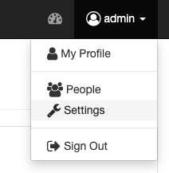

.. _userguide:

User Guide
==========

The user guide explains how to use the Phoenix web application to interact with Web Processing Services.

.. contents::
    :local:
    :depth: 2

.. _login:

Login
-----

Press the ``Sign in`` button in the upper right corner.

.. image:: _images/signin.png

The login page offers you several options to login to Phoenix.

.. image:: _images/login.png

If you login for the first time your account needs to be activated by an administrator.

**Phoenix**

Enter the password of the Phoenix user. Phoneix login might not be available.

**OpenID**

You can use an :term:`birdhouse:OpenID` account to login to Phoenix (for example from https://openid.stackexchange.com/).

.. image:: _images/openid.png 

**ESGF OpenID**

You can use an `ESGF OpenID <https://github.com/ESGF/esgf.github.io/wiki/ESGF_Data_Download>`_. The ESGF OpenID is used later to access files from :term:`birdhouse:ESGF`. Make sure, that you have a valid ESGF OpenID of one of the ESGF Providers (http://esgf-data.dkrz.de/esgf-web-fe/) and that you are able to download a datafile. 

Enter the account name of your ESGF OpenID and choose the according ESGF OpenID provider (by default this is DKRZ).

.. image:: _images/esgfopenid.png

**OAuth2**

Choose one of your OAuth providers: GitHub, Google, ...

**LDAP**

Enter your LDAP username and password. LDAP might not be available.

Dashboard
---------

The dashboard shows some statistics about jobs and users. Currently there is not that much to see.

.. image:: _images/dashboard.png

.. _processes:

Processes
---------

When you have registered WPS services you can run a process. Go to the
``Processes`` tab. 

.. image:: _images/processes.png

Choose one of your registered WPS services. You will get a list of available processes (WPS ``GetCapabilities`` request). 

.. image:: _images/processes_list.png

Choose one of these processes by using the ``Execute`` button. 

.. _execute:

In case of Emu you may try the ``Hello World`` process. You will then be
prompted to enter your username:

.. image:: _images/processes_execute.png

Press the ``Submit`` button. When the process is submitted you will be shown your job list in ``Monitor``. 

.. _myjobs:

Monitor
-------

In ``Monitor`` all your running or finished jobs are listed. 
The list shows the status and progress of your jobs. 

.. image:: _images/myjobs.png

When a job has finished with success you can see the results by clicking the Job ID link.  

.. image:: _images/myjobs_output.png

If the result has a document (XML, text, NetCDF, ...) you can view or download this document with the ``View`` button.

.. _wizard:

Wizard
------

The wizard is used to chain WPS processes and to collect the input
parameters for the processes. Currently the wizard chains a user WPS process with a WPS
process to retrieve ESGF data. The chained processes are run 
with :term:`a workflow management system <birdhouse:workflow>` which is available as WPS process in
:ref:`Malleefowl <malleefowl:introduction>`. 

Go to the ``Wizard`` tab. Enter the
appropiate parameters and use ``Next`` to get to the next wizard
page. 

.. image:: _images/wizard.png

You need to choose a WPS service (e.a. Malleefowl). 

.. image:: _images/wizard_wps.png

Choose a process (in case of Malleefowl only ``Dummy``).

.. image:: _images/wizard_process.png

Select the input parameter of the choosen process (mime-type application/netcdf). 

.. image:: _images/wizard_complexinput.png

Select the input source (ESGF). 

.. image:: _images/wizard_source.png

Select an ESGF dataset (select categorie (blue) and values of this category (orange), current selection (green)). 

.. image:: _images/wizard_search.png

Please select **only one Dataset**! 

You will be prompted for your password of your OpenID if your certificate is not valid anymore. 

.. image:: _images/wizard_credentials.png

On the final page you can enter some keywords for your process and mark it as favorite (when using a favorite you don't
need to enter all parameters again). Press ``Done`` and the job will be started and shown in your job list ``My Jobs``. 

.. image:: _images/wizard_done.png

.. _myaccount:

My Account
----------

In ``My Account`` you can change your user settings (user name, organisation, openid, ...).

.. image:: _images/myaccount.png

Settings (admins only)
----------------------

When you are logged-in as admin user you have the ``Settings`` page. Here you can make administrative changes and monitor services. 

.. _register_wps:

Register a WPS or Thredds service
~~~~~~~~~~~~~~~~~~~~~~~~~~~~~~~~~

Open the ``Settings/Services`` page. Here you can see which services are registered in the catalog service (we are using :term:`birdhouse:PyCSW`). All theses services are known and useable by Phoenix.

.. image:: _images/settings_services.png

To add a new WPS service press the ``Register a new Service`` button and enter the WPS URL in the field ``Service URL``, for example Malleefowl WPS:

http://localhost:8091/wps

To add a new Thredds service press the ``Register a new Service`` button again, enter the Thredds URL and choose ``Thredds Catalog`` as service type.

.. image:: _images/add_thredds_service.png

.. _activate_users:

Activate Users
~~~~~~~~~~~~~~

Open the ``Settings/Users`` page. Here you activate/deactivate users and also remove them. When a user has registerd to the Phoenix web application the user needs to be activated before the user can login.

Choose Authentication Protocol
~~~~~~~~~~~~~~~~~~~~~~~~~~~~~~

Open the ``Settings/Auth`` page. Here you can choose the different authentication protocols (OpenID, LDAP, ...) which users can use on the login page.

.. image:: _images/settings_auth.png 

LDAP Support
~~~~~~~~~~~~

Basic support for authentication via LDAP has been added recently. To enable LDAP login for your environment, login with your admin account, navigate to ``Settings/LDAP`` and configure Phoenix to match your LDAP environment.

.. image:: _images/settings_ldap.png

There is no support for LDAP authorization yet. Use the ``Settings/Users`` backend to manage the access privileges for your users. There will be an entry for each user that has been logged in once before.

Solr
~~~~

You can publish the datasets of a registered Thredds service to a Solr index server. The Solr server is setup with the Phoenix installation.

.. image:: _images/solr_index.png

Use the toggle button on the left side of the Thredds service name to activate the publishing. Publishing takes some time. Use the reload button to update the status.
The Solr search can then be used in the ``Wizard`` to select input files.

To clear the whole Solr index use the trash button.

The publisher has two parameters.

maxrecords
    Maximum number of datasets that will be published. Use -1 for unlimited.

depth
    The maximum depth level when crawling Thredds catalogs. Default is 2.

.. image:: _images/solr_params.png
   
