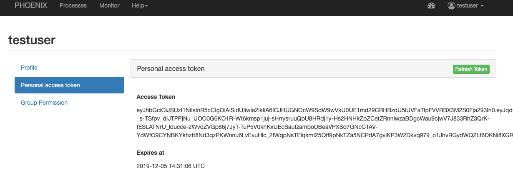

.. _userguide:

User Guide
==========

The user guide explains how to use the Phoenix web application to interact with Web Processing Services.

.. contents::
    :local:
    :depth: 2

.. _login:

Login
-----

Press the ``Sign in`` button in the upper right corner.

.. image:: _images/signin.png
  :scale: 50%

The login page offers you several options to login to Phoenix.

.. image:: _images/login.png
  :scale: 50%

You can login using your GitHub account.

If you are Phoenix admin you can also enter the admin password here.

Dashboard
---------

The dashboard shows some statistics about jobs and users.

.. image:: _images/dashboard.png

.. _processes:

Processes
---------

When you have registered WPS services you can run a process. Go to the
``Processes`` tab.

.. image:: _images/processes.png

Choose one of your registered WPS services. You will get a list of available processes (WPS ``GetCapabilities`` request).

.. image:: _images/processes_list.png

Choose one of these processes by using the ``Execute`` button.

.. _execute:

In case of Emu you may try the ``Hello World`` process. You will then be
prompted to enter your username:

.. image:: _images/processes_execute.png

Press the ``Submit`` button. When the process is submitted you will be shown your job list in ``Monitor``.

.. _myjobs:

Monitor
-------

In ``Monitor`` all your running or finished jobs are listed.
The list shows the status and progress of your jobs.

.. image:: _images/myjobs.png

When a job has finished with success you can see the results by clicking the ``Details`` button.

.. image:: _images/myjobs_details.png

If the result has a document (XML, text, NetCDF, ...) you can view or download this document with the ``Download`` button.

.. _myaccount:

My Account
----------

In ``My Account`` you can change your user settings (user name, organisation, openid, ...).

.. image:: _images/myaccount.png

You can also see your current access token which you can use to access a protected WPS service directly.

Settings (admins only)
----------------------

When you are logged-in as admin user you have the ``Settings`` page. Here you can make administrative changes and monitor services.

.. image:: _images/settings.png

.. _register_wps:

Register a WPS service
~~~~~~~~~~~~~~~~~~~~~~

Open the ``Settings/Services`` page. Here you can see which services are registered in the catalog.
All theses services are known and usable by Phoenix.

.. image:: _images/settings_services.png

To add a new WPS service, press the ``Register a new Service`` button and enter the WPS URL in the field ``Service URL``.

For example, to register Emu WPS:

http://localhost:5000/wps

.. image:: _images/add_wps_service.png

.. _activate_users:
