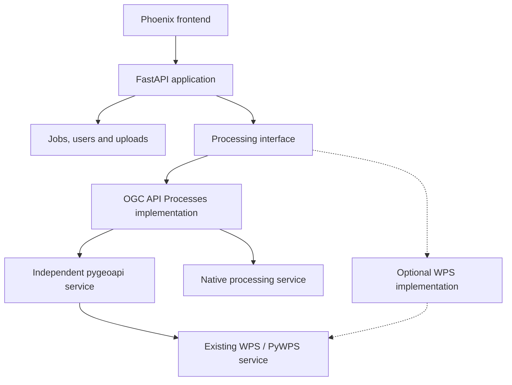
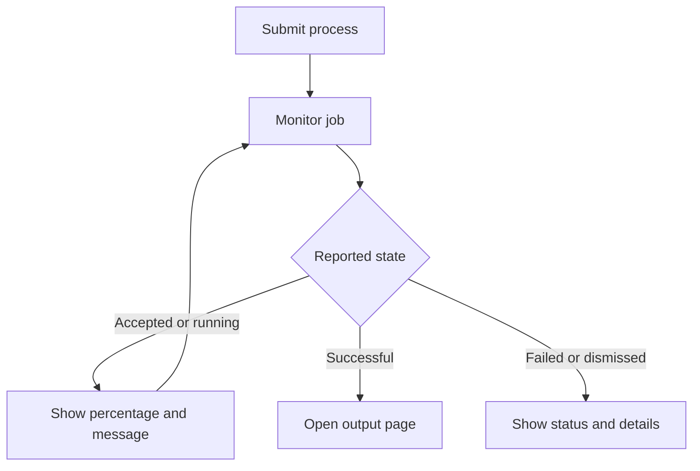
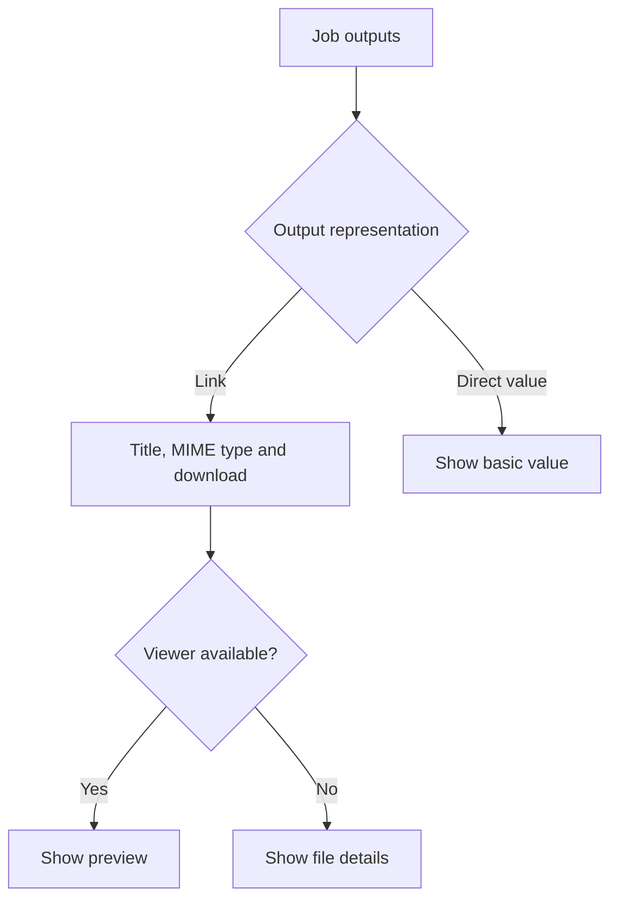

# Phoenix from the ashes: architecture proposal

**Status:** Proposal for discussion and implementation planning  
**Date:** 30 September 2026

## Purpose

Phoenix provides a web interface to discover processing services, enter inputs, execute jobs, follow their progress, and inspect results. The services themselves are mostly used as production backends. Phoenix primarily demonstrates their capabilities, but also supports people who want to use them directly, as in the UK CP project.

The existing pyramid-phoenix application has evolved over many years. Only a small subset of its functionality is actively maintained. The replacement should preserve that useful core, provide a modern interactive interface, and make it easy for projects to deploy their own customised instances.

## Main decisions

- Use **FastAPI for the Python backend** and a **JavaScript/TypeScript framework for the frontend**. Vue 3 is the proposed starting point; the frontend choice remains open to implementer experience.
- Support **OGC API Processes first**. Other OGC API capabilities may follow.
- Keep the existing Phoenix available for direct WPS use.
- Use a processing abstraction that closely follows the OGC API Processes model. Implement an OGC API Processes adapter first; a direct WPS adapter is optional future work.
- Make project customisation, authentication, and authorization part of the core design.
- Provide simple, repeatable deployment through Ansible for a local VM and Docker Compose for containers. Replace the legacy buildout deployment.
- Keep computation in the registered processing services. Phoenix manages interaction and records the user's jobs.

## Architecture

The application has three main layers:

| Layer | Responsibilities |
| --- | --- |
| Frontend | Navigation, process forms, uploads, job monitoring, result presentation, project branding |
| Phoenix backend | Application API, validation, service registry, identities and permissions, job records, upload management |
| Service implementations | Discover remote capabilities, translate process descriptions, submit execution requests, retrieve status and results |

The frontend communicates with the Phoenix backend. The backend communicates with registered services. This gives Phoenix one place to handle credentials, permissions, validation, service differences, and errors.

Deploy frontend and backend under one origin where practical. A single repository is a reasonable starting point, with separate frontend, backend, and configuration directories.



### Proposed technology choices

| Component | Proposal |
| --- | --- |
| Backend API and models | FastAPI and Pydantic |
| Frontend | Vue 3, TypeScript, and Vite |
| Persistent state | PostgreSQL, SQLAlchemy, and Alembic |
| Uploaded files | Filesystem initially, with a storage interface allowing object storage later |
| Authentication | Pluggable local and OAuth2/OIDC integrations |

These choices should be confirmed during the first implementation milestone. Django is outside the proposed architecture.

## Processing model and protocol support

The shared processing model should closely follow **OGC API Processes**, including process descriptions, input schemas, output formats, execution options, jobs, status, results, and links. Preserve original service metadata where necessary rather than discarding information during translation.

The service interface should cover operations such as:

- List and describe processes.
- Execute a process.
- Retrieve job status and results.
- List jobs or cancel execution where supported.

Expose optional operations and features as explicit capabilities. The frontend can then present only actions supported by the service and permitted for the user.

### Optional WPS implementation

The processing interface has two possible implementations: the initial **OGC API Processes implementation** and an **optional direct WPS implementation**. Direct WPS support is not required for the first release; the existing Phoenix remains available for direct WPS access.

If implemented, the WPS module calls existing WPS services through the same shared processing interface. It may support fewer features or require translation, compatibility state, and workarounds. **All WPS-specific behaviour belongs inside that implementation module, not in the Phoenix API or frontend.** The shared model must not be weakened to the common denominator of both protocols.

### Independent pygeoapi service for WPS backends

A separate approach is a proposed **WPS adapter/provider in pygeoapi**. Deploy a pygeoapi service with that provider, exposing OGC API Processes and delegating jobs to an existing WPS/PyWPS service:

1. Phoenix, or any other OGC API Processes client, calls the pygeoapi service.
2. The pygeoapi WPS provider translates requests and delegates execution to the existing WPS/PyWPS service.
3. The provider translates remote job status and results into the OGC API Processes model.

This service is independently deployable and useful outside Phoenix. Phoenix registers it like any other OGC API Processes endpoint; it does not need to know which processing backend is behind it. Developing and deploying the provider is separate work from implementing Phoenix.

Embedding or reusing the provider as a library inside Phoenix could be evaluated later, but is **optional and not part of the baseline architecture**. Whether that would provide useful reuse without coupling Phoenix to pygeoapi internals remains an open question. It should not be required for either the OGC API Processes implementation or the optional direct WPS implementation.

## Service registration and future OGC APIs

Register a service endpoint together with its configuration and discovered capabilities. Do not assume that every registered endpoint is a processing service.

Processes is the first capability module. Future modules could support:

| OGC API capability | Potential use in Phoenix |
| --- | --- |
| Features | Select features or an area as process input |
| Coverages | Select coverage data and subsets |
| Maps / Tiles | Display spatial context or suitable outputs |
| Records | Discover datasets to use as inputs |

Modules share service registration, authentication infrastructure, and project configuration, but retain their own domain models. Data and map services should not be forced into the process/job abstraction.

## Process pages and forms

The process page should present the process **title, identifier, version, description, and preview image**, where supplied. These details help users understand what a process does before starting a job. Missing optional metadata should not prevent execution.

Define a small metadata convention for presentation links. In particular, distinguish a **process preview image** from an output produced by a job. The convention needs agreed link relations or metadata role identifiers, media types, and optional titles. These metadata roles are unrelated to user authorization roles.

| Metadata | Phoenix presentation |
| --- | --- |
| Title and identifier | Process heading and stable reference |
| Version | Visible process version, also recorded with the job |
| Description | Explanatory text above the form |
| Preview image link | Thumbnail in listings and image on the process page |
| Documentation link | Link to further information |

For WPS-backed services, define how WPS metadata roles map to the OGC API process description and links in the pygeoapi provider. A future direct WPS implementation uses the same convention internally. Exact role identifiers and mappings remain to be agreed; Phoenix should not introduce a WPS-specific public API to expose them.

Every supported process should receive a usable form from its metadata. Basic controls should cover strings, numbers, choices, repeated inputs, bounding boxes, file uploads, and URL references where described by the service.

Projects can improve those generated forms through configuration: field grouping, labels, help text, defaults, ordering, and appropriate widgets. More specialised requirements can use custom components, such as dataset selection, date controls, or maps.

Keep presentation overrides separate from protocol implementations. A registered process should work without a custom interface; customisation improves the experience for frequently used processes.

A schema-driven form library such as JSON Forms is a candidate to evaluate, not a requirement.

## Job monitor and output pages

The monitor and output pages are core user-facing features, including for demonstration instances. They should provide a clear, attractive presentation of what the remote service reports.

### Job monitor

Provide a dedicated monitor page for each job, with:

- Process title and version, job identifier, and submission time.
- Current state, such as accepted, running, successful, failed, or dismissed.
- A progress bar and percentage when the service supplies progress.
- The latest status message supplied by the service.
- Last refresh time and a clear indication of refresh or connection problems.
- A link to the output page when results are available.
- Cancellation where supported by the service and permitted for the user.

Both OGC API Processes and WPS-backed integrations should preserve reported progress and status messages in the common job model. Percentage and message are optional: show an indeterminate indicator when progress is unknown, and do not invent a percentage from elapsed time. A temporary polling failure should not be displayed as a processing failure.



### Output page

Provide a dedicated output page with one clearly labelled card or row per output. Display the output identifier, title or description where available, **MIME type**, an appropriate preview, and a **download button** for downloadable outputs.

Outputs are normally remote links. Preserve their references and declared MIME types in the shared model. Use MIME types to select suitable viewers, such as an image preview or a text viewer. For formats without a viewer, show metadata and a download action. Clearly indicate when the MIME type is unknown or a linked result is no longer available.

Inline or direct output values may also occur. Preserve and present these as values rather than assuming every output has a URL. Define their exact rendering during implementation; richer handling is outside the initial scope. A direct scalar value does not need a download button.

Preview and download access must respect job visibility and remote-service authentication. Add specialised viewers through the result-viewer extension interface.



## Illustrative UI mockups

The accompanying [Phoenix UI mockups](https://github.com/bird-house/pyramid-phoenix/blob/master/phoenix-ui-mockups.html) illustrate four screens: service and process selection, job execution, the job monitor, and outputs. Open the HTML file in a browser and switch between the screens, or follow the execute and completed-example actions.

These are simplified design examples with fictional process metadata, progress, and results. They do not call a service. Download buttons provide small sample files locally. They demonstrate the intended information hierarchy rather than prescribe a final visual design.

| Screen | Main elements |
| --- | --- |
| Services and processes | Choose among registered processing services, view the selected service description, and browse its processes |
| Execution | Process title, version, description, metadata preview image, generated input form, file upload, execute action |
| Monitor | Job state, percentage and progress bar, service status message, submission summary, cancellation action |
| Outputs | Output titles, MIME types, image and text previews, download actions for linked files, basic direct-value display |

Branding and presentation should remain configurable per project. Guest users may browse process details and published results; execution and cancellation actions depend on permissions.

## Project customisation

Projects should be able to deploy recognisable Phoenix instances without maintaining forks.

### Configuration

Support instance-specific configuration for:

- Logo, colours, application title, introductory text, and project links.
- Navigation, service visibility, and featured services or processes.
- Process form layouts and presentation overrides.
- Authentication mode, role assignment, and anonymous access policy.

Prefer a shared application build that loads instance configuration at runtime. Only public configuration is sent to the browser; credentials remain on the backend.

### Extensions

Provide explicit extension points for custom input widgets and result viewers. Build-time extensions are sufficient initially; a runtime plugin system is not required for the first release.

## Authentication and authorization

Authentication establishes identity. Authorization decides which actions that identity can perform. Keep these concerns separate and use one permission model across all authentication modes.

| Authentication mode | Description |
| --- | --- |
| No auth | Anonymous access for demo and testing instances |
| Local accounts | Phoenix-managed accounts with predefined roles |
| Federated login | OAuth2/OIDC integrations supporting providers such as GitHub, Google, and ORCID |

Provider-specific login differences belong in authentication integrations. Every integration resolves to the same internal user identity. An identity broker such as Keycloak is an optional deployment choice, not a mandatory dependency.

### Initial roles

| Action | Guest | User | Admin |
| --- | --- | --- | --- |
| Browse visible services and processes | Yes | Yes | Yes |
| View explicitly published jobs and results | Yes | Yes | Yes |
| Upload inputs and execute jobs | No | Yes | Yes |
| View and manage own jobs and uploads | No | Yes | Yes |
| Manage services, users, and instance settings | No | No | Yes |

Guest access is read-only. Jobs, inputs, and uploads are private by default; guests do not gain access to other users' private work. Administrative access to private content should be defined explicitly during implementation.

No-auth mode is a separate deployment policy: an instance may explicitly enable anonymous execution for demonstrations. Otherwise, anonymous access is read-only. Define ownership and access for anonymous jobs and uploads before enabling this option.

Federated login does not automatically grant execution permission. Configure a default role, preferably guest, and allow administrator approval or mapping of trusted identity-provider groups to Phoenix roles. Identify federated accounts by stable provider identifiers rather than assuming matching email addresses mean the same person.

Enforce authorization in the backend for every operation, including uploads, execution, cancellation, configuration changes, and access to jobs and results. Frontend visibility reflects these permissions but does not enforce them.

### Credentials for remote services

Phoenix login and remote-service authentication are separate. A deployment may use a configured service account or supported user credential delegation to call a service. Configure this per service, and do not assume a token used to log into Phoenix is valid for every processing backend.

## Jobs and uploads

Store job records persistently so users can leave, return, and continue monitoring. Record ownership, service and process identifiers, remote job identifiers or links, submitted inputs, timestamps, status, reported percentage and message, and result references or direct values. Keep process-description snapshots where needed to explain or reproduce a submission.

Begin with polling for remote status. Phoenix should retrieve current status after a user returns. Add a background monitor or server-sent events only when requirements justify them. Computation remains in the remote service.

Treat an upload as a managed resource:

1. Upload the file and obtain a Phoenix upload identifier.
2. Validate ownership and relevant size or format restrictions.
3. Reference it when submitting the process inputs.
4. Make it accessible to the remote service through a supported transfer mechanism.
5. Apply a defined retention and cleanup policy.

Track ownership, storage location, format, size, and expiry. Remote access must work for protected uploads without making them permanently public. Keep file transfer details inside the storage and service integration layers.

## Deployment and operations

**A standard Phoenix instance must be easy to install and update.** Deployment is part of the product, not an exercise left to each project. Replace the legacy buildout setup with two supported paths:

| Deployment path | Approach | Intended use |
| --- | --- | --- |
| Local VM | Ansible applied to the local VM, with a small inventory when needed | Straightforward installation on an existing project VM |
| Containers | Docker with Docker Compose by default | A complete instance with its required services and persistent volumes |

Both paths should use the same application configuration model and offer a short, predictable workflow. The VM path should be as simple as the approach used for piddiplatsch. Ansible runs should be idempotent so applying configuration again is routine.

### Operator workflow

The proposed command interface is illustrative; implementers should preserve its simplicity:

```bash
git clone <phoenix-repository>
cd <phoenix-repository>
make install
```

For a customised instance, create or edit an optional `custom.yaml` and reapply it:

```bash
make install
# Later, after configuration changes or an application update:
make update
```

For Docker Compose, an equivalent interface could select the deployment mode:

```bash
make install DEPLOYMENT=docker
make update DEPLOYMENT=docker
```

The exact mode selector and default remain to be chosen. Operators may also use Docker Compose directly, but the documented default should remain a small number of commands. The Makefile should coordinate installation and updates rather than require operators to reproduce internal steps manually.

### Configuration and persistence

Ship working defaults plus a clearly documented example `custom.yaml`. Custom settings override defaults for project branding, service endpoints, authentication, public URL, storage, and relevant deployment options. Ordinary customisation must not require editing source files or generated deployment files.

Keep secrets in a separate protected environment or secrets file; never place them in configuration delivered to the browser. Installation should explain any required credentials concisely and make initial administrator setup straightforward.

Install and update commands should apply configuration, build or obtain frontend assets, manage required services, run database migrations, and restart affected components as appropriate for the selected path. They must preserve the database, uploaded files, custom configuration, and secrets. Updates must not reset an instance. Docker Compose should define persistent volumes; VM deployments should use stable data directories outside the checkout.

Provide consistent commands for start, stop, status, and logs, with clear error messages when prerequisites are missing. Define an explicit version-update procedure rather than silently switching to an arbitrary latest version. Include a short backup and restore recipe for persistent data.

### Documentation requirement

The quick start should fit on one short page: prerequisites, installation commands, optional custom configuration, and how to open the instance. Put advanced deployment options and troubleshooting in separate reference pages. A standard deployment must not require following a lengthy manual or assembling its database, web server, and application configuration by hand.

## First implementation milestone

Build one complete user journey:

**Register service → select process → complete form → upload input → execute → leave and return → inspect results.**

Include:

- A branded instance using configuration.
- Working Ansible/VM and Docker Compose deployment paths with simple install/update commands and a short quick start.
- One OGC API Processes implementation and capability-aware controls.
- Generated forms with basic presentation overrides.
- Persistent jobs and managed uploads.
- Process pages showing title, description, version, and an optional preview image.
- A dedicated job monitor showing reported percentage, status messages, and useful failure details.
- An output page showing MIME types, previews, and download buttons for linked outputs.
- Authentication modes and backend enforcement of guest, user, and admin permissions.

Validate against a native OGC API Processes service and, when the independent pygeoapi WPS provider is available, an existing WPS/PyWPS service exposed through it. Phoenix development does not depend on that provider being implemented first. Check private-resource access as well as the successful execution path.

Direct WPS support, additional OGC API modules, sophisticated viewers, and a runtime plugin system can follow later.

## Decisions to resolve during implementation

- Confirm the frontend framework based on contributor experience.
- Choose the default deployment path, exact Makefile commands, supported VM prerequisites, and custom YAML configuration structure.
- Decide whether and when to add a direct WPS implementation. Any embedded library reuse of the pygeoapi provider requires a separate evaluation.
- Choose initial login integrations and whether deployments use an identity broker.
- Define anonymous job ownership, retention, and administrative access to private work.
- Choose how remote services retrieve protected uploaded inputs.
- Verify process-schema coverage and form behaviour against representative services.
- Agree metadata role identifiers and the WPS-to-OGC API mapping for preview images and documentation.
- Define initial inline-output rendering and authenticated preview/download behaviour.
- Decide whether status refresh on access is sufficient or a background monitor is needed.

The intended outcome is a small, maintainable core that presents processing capabilities consistently, while projects configure their identity, presentation, and access policy.

## Appendix

### Links

| Project / reference | Link | Relevance |
| --- | --- | --- |
| pyramid-phoenix | [Source repository](https://github.com/bird-house/pyramid-phoenix) | Existing Phoenix application; reference for maintained functionality, customisation, and WPS interaction. |
| Emu | [Source repository](https://github.com/bird-house/emu) | Birdhouse demo and testing WPS built with PyWPS; useful for testing WPS integration and the proposed pygeoapi provider. |
| Nandu | [Source repository](https://github.com/bird-house/nandu) | Birdhouse OGC API Processes demo using pygeoapi; a candidate service for the first Phoenix implementation milestone. |
| pygeoapi | [Project website](https://pygeoapi.io/) · [Source repository](https://github.com/geopython/pygeoapi) | Python implementation of OGC APIs; host for the proposed independent WPS provider. |
| OGC API Processes | [Overview and resources](https://ogcapi.ogc.org/processes/) · [Part 1: Core standard](https://docs.ogc.org/is/18-062r2/18-062r2.html) | Reference for the shared processing model, process descriptions, execution, jobs, and results. |
| UK Climate Projections (UKCP) | [User interface](https://ukclimateprojections-ui.metoffice.gov.uk/ui/home) · [API documentation](https://ukclimateprojections-ui.metoffice.gov.uk/help/api) | Existing project use case; reference for direct user interaction with climate processing services. |

The pygeoapi WPS provider described in this proposal is planned work; the pygeoapi links above do not imply that this provider already exists.

### UI design

[View the simplified UI mockups on master](https://htmlpreview.github.io/?https://raw.githubusercontent.com/bird-house/pyramid-phoenix/master/phoenix-ui-mockups.html). The mockups illustrate service and process selection, job execution, monitoring, and outputs.

The proposal and UI mockups are intended to live together at the root of the pyramid-phoenix repository as `phoenix-architecture-proposal.md` and `phoenix-ui-mockups.html`. GitHub displays the HTML source; download the mockup file to view and interact with it in a browser.
